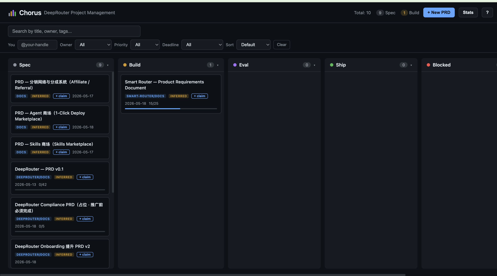

<p align="center">
  
</p>

<h1 align="center">Chorus</h1>

<p align="center"><strong>AI-Native Project Management. No Jira. No Linear. Just Markdown.</strong></p>

Chorus is a project management system where markdown files are the database, AI agents auto-update status and checklists, and a local kanban board gives you drag-and-drop control. Built for teams where every developer works with AI.

```
Your PRDs are your project management tool.
Your AI is your project manager.
Your Git repo is your single source of truth.
```

<p align="center">
  
</p>

---

## The Problem

Your team uses AI coding assistants (Claude Code, Cursor, Copilot). But your project management still lives in Jira or Linear — tools your AI can't read or write. So you end up:

- Copying ticket descriptions into AI prompts
- Manually updating ticket status after AI finishes work
- Losing sync between what the code says and what the board says
- Paying per-seat for a tool that adds friction, not flow

## The Idea

What if your project management artifacts were just markdown files in your repo?

- AI can **read** them natively (no API integration)
- AI can **write** them natively (update status, check off items)
- Git gives you **version control, audit trail, and sync** for free
- A local kanban board gives you **drag-and-drop** when you want it

That's Chorus.

## How It Works

```
┌──────────────────────────────────────────────────────┐
│                                                      │
│   PRD.md              ← YAML frontmatter = database  │
│   ┌──────────────┐                                   │
│   │ ---           │                                   │
│   │ title: ...    │    Humans: edit md, drag kanban   │
│   │ status: ...   │◄──────────────────────────────── │
│   │ owner: ...    │                                   │
│   │ ---           │    AI agents: auto-update status, │
│   │               │    check off items, infer state   │
│   │ ## Criteria   │◄──────────────────────────────── │
│   │ - [x] Done    │                                   │
│   │ - [ ] Todo    │    Kanban board: drag-and-drop    │
│   └──────────────┘    at localhost:4000               │
│         │                                             │
│         ▼                                             │
│   Git repo (sync, audit, collaboration)               │
│                                                      │
└──────────────────────────────────────────────────────┘
```

Every PRD has YAML frontmatter:

```yaml
---
title: User Authentication Redesign
date: 2026-04-06
status: in-progress
owner: "@alice"
priority: high
tags: [backend, auth]
---

## Acceptance Criteria
- [x] JWT token refresh implemented
- [ ] OAuth2 provider added
- [ ] Rate limiting on login endpoint
```

That's it. That's the database.

## Quick Start

### 1. Copy the scripts into your project

```
your-project/
├── scripts/
│   ├── prd-board/
│   │   ├── server.mjs        # Kanban board server
│   │   └── index.html         # Kanban UI
│   └── generate-prd-dashboard.mjs  # Dashboard generator
├── docs/
│   └── prd/
│       └── TEMPLATE.md        # PRD template
└── .claude/
    └── agents/
        └── chorus-steward.md  # PM steward agent (Claude Code, optional)
```

### 2. Start the kanban board

```bash
node scripts/prd-board/server.mjs
```

Open **http://localhost:4000**. That's it. It scans your `docs/` directory, finds all markdown files with frontmatter, and displays them as a kanban board.

### 3. Create a PRD

```bash
cp docs/prd/TEMPLATE.md docs/prd/my-feature.md
```

Edit the frontmatter and content. It appears on the board instantly.

### 4. Manage

- **Drag cards** between columns to change status
- **Click cards** to read the full PRD (rendered markdown)
- **Click checkboxes** to toggle completion (writes back to the file)
- **Search** by title, owner, or tags
- **Collapse columns** you don't need (saved to localStorage)

### 5. Generate a static dashboard

```bash
node scripts/generate-prd-dashboard.mjs
```

Outputs `docs/DASHBOARD.md` — commit it to Git so everyone can see project status without running the server.

## AI Integration

The real power of Chorus is when your AI coding assistant follows these rules:

### Add to your AI rules (Claude Code, Cursor, etc.)

```markdown
# Chorus Rules

1. Before starting any task, search docs/ for a related PRD
2. If no PRD exists for a non-trivial task, create one from the template
3. When starting work: set status to in-progress
4. Check off acceptance criteria as you complete them: - [ ] → - [x]
5. When all criteria are met: set status to review or done
6. If a PRD lacks YAML frontmatter, add it immediately
7. After any status change: run node scripts/generate-prd-dashboard.mjs
8. Commit PRD changes with the related code; commit + push standalone
   PRD changes immediately — uncommitted status is invisible to the team
```

The full version of these rules lives in [`chorus-rules.md`](chorus-rules.md).

### The steward agent: a dedicated PM for your repo

Rules cover the happy path, but boards still drift: someone forgets to
push, code merges without its PRD, a PRD sits in-progress for weeks.
Chorus ships a **steward subagent** ([`.claude/agents/chorus-steward.md`](.claude/agents/chorus-steward.md))
that acts as a dedicated project manager. Since it lives in the repo,
everyone on the team gets it automatically via `git pull`.

In Claude Code, just ask:

```
> Use the chorus-steward agent to audit the PRDs
```

The steward:

1. **Detects status drift** — code merged but PRD still says in-progress?
   Checkboxes that shipped but were never checked? It fixes them.
2. **Surfaces what matters** — reports all critical/high priority PRDs
   that aren't done, most important first
3. **Flags stale work** — in-progress PRDs with no git activity in 7+ days
4. **Normalizes** — adds missing frontmatter, fixes status values
5. **Commits + pushes** its fixes and regenerates the dashboard

Run it at the start of the day, before sprint planning, or whenever the
board feels out of sync with reality.

### What happens

```
Developer: "Add OAuth2 login"

AI Agent:
  1. Finds docs/prd/user-auth-redesign.md
  2. Reads acceptance criteria
  3. Sets status: in-progress
  4. Implements OAuth2
  5. Checks off "- [x] OAuth2 provider added"
  6. All criteria done → sets status: done
  7. Regenerates dashboard

Developer: git pull → sees updated status on the board
```

No one told the AI to update the board. It just did, because the board IS the markdown file.

## Features

### Kanban Board (`localhost:4000`)

- Drag-and-drop between columns: Draft → Ready → In Progress → Review → Done → Blocked → Archived
- Click to view full PRD with rendered markdown (headings, tables, code blocks, checklists)
- Click checkboxes to toggle — writes directly to the `.md` file
- Search/filter by title, owner, git author, tags
- Category badges for PRDs from different directories
- Progress bars showing checklist completion
- Git author auto-detection (no manual owner assignment needed)
- Column collapse state saved to localStorage
- Status inference for PRDs without explicit status

### Dashboard Generator

- Scans multiple directories
- Groups PRDs by status with counts
- Outputs clean markdown table — works in GitHub, VS Code, any renderer
- Shows owner, date, and file links

### Zero Dependencies

- Pure Node.js `http` module (no Express, no frameworks)
- Vanilla HTML/JS frontend (no React, no build step)
- No database (filesystem IS the database)
- No config files (convention over configuration)
- Works with Node.js 18+

## Configuration

### Scan directories

Edit `SCAN_DIRS` in `scripts/prd-board/server.mjs`:

```js
const SCAN_DIRS = [
  'docs/prd',
  'docs/business',
  'docs/design',
  // Add your directories here
];
```

### Status columns

Edit `STATUS_ORDER` in `server.mjs`:

```js
const STATUS_ORDER = [
  'draft',        // New, not yet started
  'ready',        // Scoped and ready to pick up
  'in-progress',  // Someone (human or AI) is working on it
  'review',       // Implementation done, needs verification
  'done',         // Shipped
  'blocked',      // Waiting on something
  'archived',     // No longer relevant
];
```

### Port

Default is `4000`. Change `PORT` in `server.mjs`.

### Git auto-sync — your repo as a synced folder

By default, edits only change files on disk — you commit them yourself. Turn
on auto-sync and your `docs/` folder behaves like a Dropbox/OneDrive folder:
edit locally, and it stays in sync with the remote in both directions,
transparently. No one has to remember to commit a PRD.

```bash
CHORUS_GIT_SYNC=1 node scripts/prd-board/server.mjs       # bidirectional: auto commit + pull + push
CHORUS_GIT_SYNC=commit node scripts/prd-board/server.mjs  # auto commit only (push via PR)
```

What it does:

- **Watches the whole folder, not just the board.** Any change to a PRD —
  dragging a card, checking a box, *or an AI agent editing the file
  directly* — is detected via `fs.watch` and committed. This is the point:
  Chorus's whole premise is AI agents updating PRDs, and they edit files,
  not the board.
- **Debounces commits.** A burst of activity lands as one commit
  (`chorus: user-auth-redesign → done`), ~10s after the last edit.
- **Pulls teammates' changes** every 30s (with push-sync on). When a
  teammate's change arrives, your board refreshes on its own — no reload.
- **Never resolves conflicts by guessing.** If the same PRD changed both
  locally and on the remote, auto-sync *pauses*, shows a banner, and keeps
  your local commit intact. Resolve it with `git pull --rebase` as usual;
  sync resumes automatically once the tree is clean. Unlike a plain
  file-sync tool, nothing is silently overwritten or lost.

Tune the pull interval with `CHORUS_GIT_PULL_SECONDS` (default `30`; `0`
disables inbound pulling). The board's live-refresh works even with sync
off, so an AI agent editing a PRD updates your board instantly either way.

### Connecting GitHub — one click, no token hunting

Push/pull needs GitHub credentials. Developers already have them (if you can
`git push` your code, sync just works). For everyone else, the board offers a
**Connect GitHub** button — click it, authorize in the browser, done. It uses
GitHub's OAuth **Device Flow**, the same one-tap flow as `gh` and VS Code; the
token is handed to git's credential helper (your OS keychain), so it's stored
once and never asked for again. Each person authorizes as themselves, so
commits stay attributed.

One-time setup (by whoever distributes your Chorus board): register a GitHub
**OAuth App** — [Developer settings → New OAuth App](https://github.com/settings/developers),
turn on **Enable Device Flow** — and pass its client_id:

```bash
CHORUS_GITHUB_CLIENT_ID=Iv1.xxxxxxxxxxxx CHORUS_GIT_SYNC=1 \
  node scripts/prd-board/server.mjs
```

The client_id is public (safe to commit), and the whole team shares it —
everyone else just clicks the button. Without it, sync falls back to whatever
git credentials the machine already has.

## Frontmatter Spec

### Required fields

```yaml
---
title: Short descriptive title       # What is this PRD about
date: 2026-04-06                     # When it was created
status: draft                        # Current status (see columns)
owner: "@alice"                      # Who's responsible
---
```

### Optional fields

```yaml
priority: high                       # critical | high | medium | low
tags: [frontend, auth, v2]           # For filtering
updated: 2026-04-10                  # Last modified date
```

### Status values

| Status | Meaning |
|--------|---------|
| `draft` | Written but not started |
| `ready` | Scoped, estimated, ready to pick up |
| `in-progress` | Actively being worked on |
| `review` | Done, awaiting verification |
| `done` | Shipped and verified |
| `blocked` | Waiting on dependency or decision |
| `archived` | No longer relevant |

### Status aliases

The system normalizes common variations:

| You write | Normalized to |
|-----------|---------------|
| `wip`, `in development` | `in-progress` |
| `completed`, `shipped`, `implemented` | `done` |
| `confirmed`, `approved` | `ready` |
| `on hold` | `blocked` |
| `deprecated`, `legacy` | `archived` |

## The Chorus Philosophy

### 1. No tool tax

If it can be a markdown file, it should be. Every external tool you add is a context switch, a sync problem, and a per-seat cost.

### 2. AI-first interface

Design your project artifacts for AI readability. Humans benefit too — markdown is universal. But the key insight is: if your AI can natively read and write your project management data, half your coordination overhead disappears.

### 3. Git is the backbone

Version control, audit trail, collaboration, code review — Git already does all of this. Why duplicate it in another tool?

### 4. Checklists over status meetings

A checked box in a PRD is worth a thousand standup words. It's specific, verifiable, and permanent.

### 5. Quality is a system, not a person

When every developer's AI reads the same rules and follows the same templates, output quality converges. A team of 3 with Chorus operates like a team of 10.

## Comparison

| | Jira/Linear | Notion | GitHub Issues | **Chorus** |
|---|---|---|---|---|
| AI can read/write natively | No | No | Via API | **Yes** |
| Lives in your repo | No | No | Separate | **Yes** |
| Version controlled | No | Partial | Partial | **Yes (Git)** |
| Works offline | No | No | No | **Yes** |
| Zero dependencies | No | No | No | **Yes** |
| Cost | $$$  | $$ | Free | **Free** |
| Setup time | Hours | Hours | Minutes | **Seconds** |
| Context switching | High | High | Medium | **None** |

## Who Is This For

- **Small teams (2-10)** where everyone uses AI coding assistants
- **Solo developers** who want structure without overhead
- **AI-first teams** that want their tools to work WITH their AI, not around it
- **Open source projects** that want project management in the repo, not in a SaaS

## Who Is This NOT For

- Large organizations that need enterprise audit/compliance features
- Teams that need time tracking, sprint velocity, or burndown charts
- Non-technical stakeholders who can't work with markdown/Git

## Contributing

Chorus is intentionally simple. Before adding a feature, ask:

1. Can this be done with existing markdown conventions instead?
2. Does this add a dependency?
3. Would this break the "zero config" experience?

If any answer is "yes", it probably doesn't belong in core.

## License

MIT

---

*Chorus was born at [JobPin AI](https://jobpin.ai), where a small team needed to ship fast with unified quality. We replaced Jira with markdown files and never looked back.*
